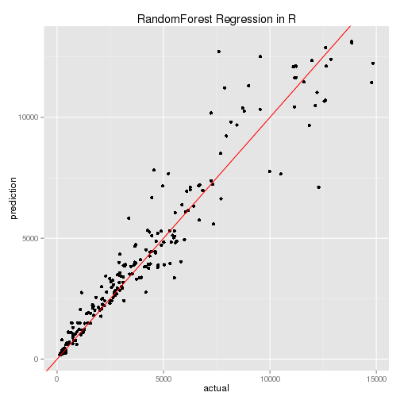

# Developing Data Products - Shiny Application and Reproducible Pitch

## Overview
For the developing Data Products course project I have created a Shiny Application which will predict diamond price on the basis of chosen parameters. Diamond dataset which I have collected from the website http://www.pricescope.com/. Diamond price determined by several factors, such as carat, Clarity, Cut etc. In my dataset I have choosen 6 predictors - Shape, Carat,Cut, Color, Clarity, Depth.

## Data Preparation
Read the dataset [Diamond_price.csv](https://github.com/anupb08/DataProducts) which is in the current directory.

```r
data <- read.csv("Diamond_price.csv", header=TRUE)
str(data)
```

```
## 'data.frame':	1000 obs. of  10 variables:
##  $ Shape       : Factor w/ 10 levels "Asscher","Cushion",..: 4 4 4 4 4 4 4 4 4 4 ...
##  $ Carat       : num  3.13 1.03 1.02 1.63 1.2 1.5 1.71 2.04 2.04 1.67 ...
##  $ Cut         : Factor w/ 3 levels "Good","Ideal",..: 1 1 1 1 2 2 2 2 2 2 ...
##  $ Color       : Factor w/ 9 levels "D","E","F","G",..: 1 5 4 8 2 2 5 3 3 6 ...
##  $ Clarity     : Factor w/ 9 levels "I1","I2","IF",..: 5 1 5 5 5 5 5 5 5 5 ...
##  $ Table       : num  54 51 56 63 48.4 52 51.4 52 64.9 54.5 ...
##  $ Depth       : num  56.9 57.5 51.3 43 57.9 53 61.4 50.2 39.3 41.6 ...
##  $ Cert        : Factor w/ 3 levels "AGS","AGSL","GIA": 1 1 1 1 1 1 1 1 1 1 ...
##  $ Measurements: Factor w/ 792 levels "","0 x 0 x 0",..: 750 450 475 649 614 681 699 728 787 651 ...
##  $ Price       : Factor w/ 868 levels "$1,010","$1,036",..: 428 462 459 565 665 795 827 176 151 756 ...
```

```r
data$Price <- gsub('\\$', '', data$Price)
data$Price <- gsub(',', '', data$Price)
mydata <- data[,c(1,2,3,4,5,7,10)]
mydata$Price <- as.numeric(as.character(mydata$Price))
mydata <- mydata[mydata$Price <15000,] # remove outliers
head(mydata)
```

```
##   Shape Carat   Cut Color Clarity Depth Price
## 2 Heart  1.03  Good     H      I1  57.5  3188
## 3 Heart  1.02  Good     G     SI2  51.3  3158
## 4 Heart  1.63  Good     K     SI2  43.0  4009
## 5 Heart  1.20 Ideal     E     SI2  57.9  5256
## 6 Heart  1.50 Ideal     E     SI2  53.0  7860
## 7 Heart  1.71 Ideal     H     SI2  61.4  8557
```

## Build Model

```r
library(caret)
library(randomForest)
inTrain <- createDataPartition(mydata$Price, p=0.7,list = FALSE)
traindata <- mydata[inTrain,]
testdata <- mydata[-inTrain,]
model.forest <- train(Price~., traindata, method = "rf", trControl = trainControl(method = "cv", number = 3))
testdata$pred <- predict(model.forest, newdata = testdata)
ggplot(aes(x=actual, y=prediction),data=data.frame(actual=testdata$Price, prediction=predict(model.forest, testdata)))+ 
   geom_point() +geom_abline(color="red") +ggtitle("RandomForest Regression in R" )
```

 

The shiny appication I developed has been published in shiny server at [https://bdalmaso.shinyapps.io/diamondsapp/](https://bdalmaso.shinyapps.io/diamondsapp/).     
To reproduce the shiny application on your local system, you need to install the relevent packages (caret and randomForest) and download diamond dataset, server.R and ui.R from github [repository](https://github.com/barbaradalmaso/DevelopingDataProject/).     

## How to Run the Application
After downloading the above mentioned files you have to keep all the files in a folder and run **runApp()** function. Instantly application will be open locally in default browser. In the html page you will see at left side there are severel input parameters you have to select by drop down or by increasing/decreasing the values. After selection you have to press the Submit button, the diamond price will be shown at right side.   
The predictors are :    
1. Shape - Diamond shapes are Heart ,Round, Princess, Cushion,Pear,Marquise, Emerald, Radiant, Oval, Asscher;

2. Carat - The weight or size of the diamond ( in this project diamond weight can be from .32 carat to 4.0 carat); 

3. Cut - The proportions and relative angles of the facets. 3 type of cuts : Good ,Ideal, Very Good;    

4. Color - Color has several values, such as D, E, F, G, H, I, J, K, L;

5. Clarity - The absence of internal imperfections. Clarity has following values: 'I1', 'I2', 'IF', 'SI1', 'SI2', 'VS1', 'VS2', 'VVS1', 'VVS2';

6. Depth - Diamond depth can be very from 40 to 80.      
